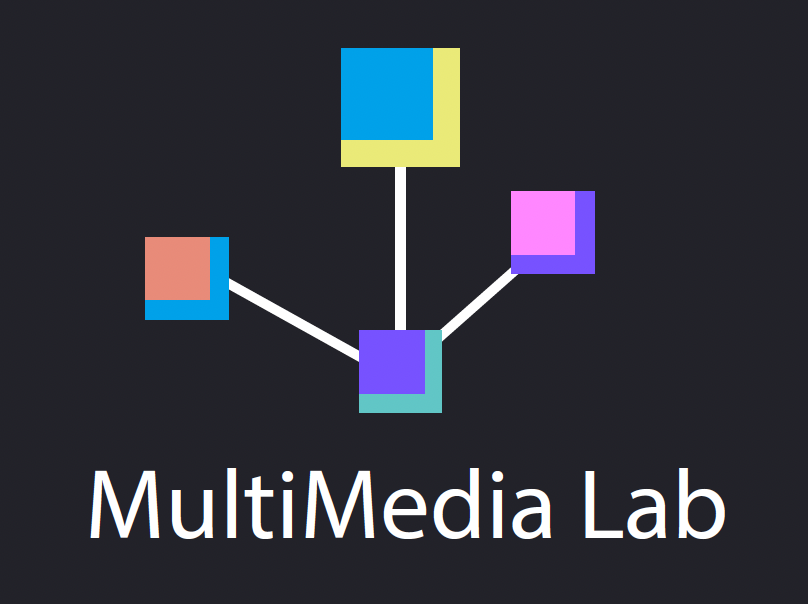

# 📘 Advanced Natural Language Processing



### 👤 Instructor: Mehmet Can Yavuz, PhD — [mehmetcanyavuz.com](http://mehmetcanyavuz.com)

Welcome to the **Natural Language Processing (NLP)** course repository! This repo includes lecture slides, notes, and code for studying **algorithms, machine learning, and advanced NLP systems**.

---

## 📑 Course Modules
### 🔹 Module 1: Algorithms and Applications
This module introduces the **core foundations of NLP algorithms** and their practical applications.

* **Words and Dictionaries**
  * Words, Comparing, Dictionaries
* **Statistical Foundations**
  * Classification
  * Regression
  * Hypotheses & Non-Parametric Tests
* **Semantic Representations**
  * Vector Semantics
  * Word Embeddings
* **Deep Learning Models**
  * MLP
  * CNN
  * LSTM
  * Attention
* **Annotation and Resources**
  * Annotation Practices
  * WordNet
  * POS Tagging
  * Named Entity Recognition (NER)
  * Sequence Labeling
* **Syntactic and Semantic Structures**
  * Syntax
  * Coreference Resolution
  * Information Extraction (IE, IE2)

---

### 🔹 Module 2: Computational Linguistics (Overview)
This module gives a **broad overview** of formal models of language, parsing, and discourse-level concepts.

* **Parsing Basics**
  * CFG Parsing
  * Dependency Parsing
* **Semantics**
  * Compositional Semantics
  * Verb Semantics
* **Discourse and Coherence**
  * Discourse Coherence
  * Time & Temporal Representation
  * Coreference and Relations

---

### 🔹 Module 3: Advanced Language Systems
This module explores **applied NLP systems and modern large-scale models**.

* Machine Translation
* Question Answering
* Dialogue Systems
* **Large Language Models (LLMs)**
  * Transformers & BERT & T5
  * Position Encoding & Multi-head Attention
  * Foundations of LLMs
  * LLM Architectures & GPT-3
  * Prompt Engineering (Zero-shot & One-shot)
  * Reinforcement Learning with Human Feedback
  * Hallucination
  * Chain-of-thought
  * **Applications**: Hugging Face Transformers & LLM practice notebooks

---

## 📂 Repository Structure

```bash
M1 - Algorithms and Applications/   # Core NLP topics
M2 - Computational Linguistics/     # Overview of parsing & semantics
M3 - Advanced Language Systems/     # MT, QA, Dialogue, LLMs
codes/                             # Hands-on implementations
```

---

## 🎯 Learning Outcomes
By the end of this course, you will be able to:

* Understand the **theoretical foundations** of NLP.
* Apply **statistical & deep learning methods** to core NLP tasks.
* Gain an **overview of computational linguistics concepts**.
* Build and evaluate advanced systems like MT, QA, Dialogue, and LLMs.

---

## 🚀 How to Use
1. 📖 Read the **PDF lecture notes** under each module.
2. 🎥 Review the **slides** for theory and worked examples.
3. 💻 Explore the **codes/** folder for practical implementations.

---

## ⚖️ License

This course is released under the [MIT License](LICENSE).
It has been adapted and customized from multiple academic resources, including:

* [Berkeley Info 256: Applied Natural Language Processing (2019)](https://github.com/dbamman/anlp19) — David Bamman
* [CS447: Natural Language Processing (Illinois, 2023)](https://courses.grainger.illinois.edu/cs447/sp2023/index.html) — Julia Hockenmaier
* [UT Austin NLP Online Materials](https://www.cs.utexas.edu/~gdurrett/courses/online-course/materials.html) — Greg Durrett
* [Stanford CS224n: NLP with Deep Learning](https://web.stanford.edu/class/cs224n/) — Christopher Manning et al.
